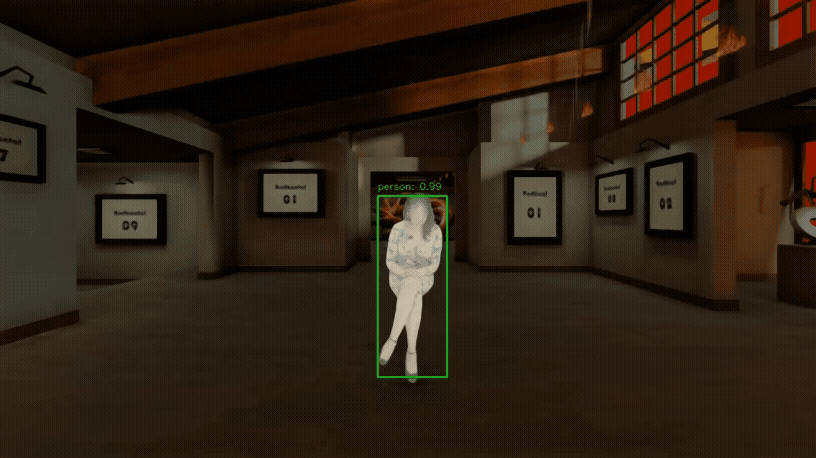

# Real-Time Face Anonymization for Enhanced Privacy in AV/XR

## Introduction / Goal
Our pipeline’s task:
- Anonymize all human faces in AV’s sensor data (RGB-D) in real-time.
- Use our privatized data to train models ⇒ output must adhere to normal human shape/looks

Core Components
- Utilize synthetic data for development and testing.
- Efficiently identify people and localizing their head regions using RGB-D data.
- Apply a fast and irreversible technique to make faces non-recognizable.

## Dataset Generation
Synthetic Data > Real Data
- Avoids collecting real-world data with identifiable faces
- Control over scenarios, lighting, number of people, and camera parameters.
- Simple togenerating ground truth for segmentation and anonymization.

Tooling: CARLA Simulator
- Simple setup and usage compared to competing simulators
- We capture RGB-D video sequences from virtual cameras mounted on simulated vehicles.
- This data is the input for our segmentation and anonymization pipeline.

### Carla Simulator
- Open-source driving simulator for AV research
- We ran simulator on NVIDIA RTX 4090 and communicated via Python API
- Able to add various stationary sensors or attach to vehicles:
  - RGB Camera
  - Depth Camera
  - Semantic Segmentation (from preset actor tag) --> Ground Truth

## Problems with Existing Solutions
- To pinpoint people, need to use instance/object segmentation (typically uses U-net architecture)
- Powerful deep learning segmentors are expensive
  - They cannot be run in real-time (i.e., ≥ 30 frames per second)
- Object detection is faster but provides coarse-grained output → risk of overmasking

## Our Proposal
Use object detection supplemented with “depth” data (RGB-D):
- Depth provides an additional layer for segmentation
- All pixels belonging to the same object fall within a small range of depth values
- Use a fast object detector (instead of an instance segmentor) and the depth values within the bounding box

### Initial Person Detection
Initial person detection
- Use a fast, pre-trained object detector
- Specifically, a Faster R-CNN trained on the COCO dataset

Depth-assisted segmentation
- Consider the depth in the center of the bounding box
- Allow pixels within a threshold of the center depth

Aside: This technique can be extended beyond AVs, such as into extended reality (XR). We merge multiple camera views into one final output.

### Head Localization Strategy
- For AV applications, our primary goal is to anonymize faces.
- Estimate the head’s region to be toward the top of the refined bounding box.
- Based on manual observations, set a fixed value of 21%.

### Optimization
Processing every frame for detection and segmentation is still too expensive
Observation: A person’s location and depth profile in the video is very similar across a few frames

Solution: Perform full person detection and head localization on the first frame of a small “chunk”, or N frames
- Frame 1: For each head in a frame, compute its center coordinates and depth profile (mean, standard deviation)
- Frame 2…N:
  - Leverage the stored depth profile from frame #1
  - Include pixels in or closely around (account for minimal movement) the original bounding box
  - Pixels that fall in the expected depth range of the depth profile are considered to be the head

→ Skip the computationally intensive object detection on most frames.
→ Improve performance and output FPS

## Facial Anonymization
Make faces non-recognizable to humans while being fast and difficult to reverse.

Explored methods:
- Generative adversarial networks (GANs)
- Inpainting
- Stable diffusion
- Simple Transformations
- Image resampling

### Generative Adversarial Networks (GANs)

A competition between a **generator (G)** and **discriminator (D)**:
- G generates synthetic images based on random noise latent vector
- D distinguishes between real data (training set) and fake data produced by G
- As iterations continue, G improves at **falsifying images** and D improves at **detecting fakes**

→ Over time, G produces high-quality synthetic images that mimics the training set and D can no longer distinguish between.

#### GANs: DeepPrivacyV2
*Goal*: Create realistic anonymized images of entire human faces/figures
- Uses the Flickr Diverse Humans (FDH) dataset (1.5M images)
- Ensemble of detectors (DSFD, CSE, Mask R-CNN) for robust facial detection
- 3 generators: CSE-guided full-body generator, unconditional full-body generator, face generator
- Removes areas to be anonymized → generators complete the missing regions. 
  - Generator never directly observes the privacy-sensitive information
- Utilizes recursive stitching of pasting anonymized individuals into the original image

*Pros*:
- Faces look more realistic

*Cons*: 
- Output 9fps is too slow for real-time video footage
- Recursive stitching causes increasingly slower runtime with more figures are on the screen

#### GANs: StyleGAN
*Goal*: Generate photorealistic and controllable synthetic images
- Map random noise vector (X) to an intermediate latent space (Y)
- Transform Y into “styles” via transformations
- Styles control various visual features (i.e., smile, hair, etc)

*Pros*:
- Fast, generates image in one pass (non-recursive)
- Can use model: `Pixel2style2pixel`

*Cons*:
- Pretrained models not applicable to our use case
- Attempted application resulted in unusable images

### Inpainting
#### DeepFill
*Goal*: Reconstruct the missing parts of an image, and make the result indistinguishable from the original

Two-Stage Coarse-to-Fine network: 

1. Output a coarse inpainted image with an encoder-decoder with dilated convolutions. 
2. Enhance the output of the coarse inpainted image using another encoder-decoder. 
    1. This component uses a contextual attention layer to find consist textures to fill the hole. 

Use GANs (GAN loss) to ensure final output is realistic OR Fourier Convolutions to ensure large masking is speedy

*Pros*: Easy to set up

*Cons*: 
- Slower runtime, but sufficient given our chunking optimization
- Completely removes the head because inpainting uses the background

### Stable Diffusion
*Goal*: Generate synthetic images by learning to reverse the process of turning image into noise, enabling it to turn noise into an image
- Forward: iteratively add small amounts of gaussian noise
- Backward: train a U-Net network to predict the noise that was added in the forward step
- Image generation: start with random noise, iteratively apply trained network, output a “denoised” image

*Pros*: 
- Diffusion models are not known to be quick
- Can use model: `runwayml/stable-diffusion-inpainting`

*Cons*: 
- Poor results and unacceptable performance

### Simple Transformations
#### Gaussian blur, matrix transformations, image smoothing

*Pros*: Extremely fast and simple compared to complex models

*Cons*: 
- Easily reversible if attacker knows the privacy preservation method.
- Not individually sufficient for a robust anonymization pipeline.

### Image Resampling

*Pros*:
- Downsampling the images and upsampling → guarantees information loss
- Anonymized face to but computer can still detect a “face” without a loss of privacy
- Simple and fast
- Very difficult to reverse

*Cons*:
- Can use sharpness methods to somewhat reconstruct

## Chosen Anonymization Technique

**Ensemble of lightweight methods --> Simple ≠ bad**

- Gaussian noise
  - Initial obfuscation
- Matrix transformations
  - Apply random transformations to distort features
- Image smoothing
  - Further blurring of finer details
- Image resampling
  - Final step to introduce information loss all around

## Results
≈25 FPS & N=5 Chunking
| Front view| Side view|
|:-:|:-:|

Depth Perturbation (Z-axis anonymization)

3D Anonymization

## Demo
### Intitial Video

### Segmentation Example
| Head Segmenation| Depth View|
|:-:|:-:|

### Final Results
| 17.6 FPS, Chunking N=1| 27.51 FPS, Chunking N=2|
|:-:|:-:|

## Evaluation Results - Speed
| Num Views / Chunking | Avg Segmentation Time per Frame (s) | Avg Anonymization Time per Frame (s) | FPS   |
|:--------------------:|:--------------------------------:|:---------------------------------:|:-----:|
| V=1, C=1             | 0.0225                           | 0.0343                            | 17.60 |
| V=1, C=2             | 0.0148                           | 0.02155                           | 27.51 |
| V=2, C=2             | 0.0228                           | 0.0408                            | 15.72 |
| V=2, C=4             | 0.01418                          | 0.026                             | 24.86 |

## Evaluation Results - Similarity
| Chunking | Average Dice | Average Recall |
|:--------:|:------------:|:--------------:|
|   C=1    |    0.9340    |     0.9329     |
|   C=2    |    0.9163    |     0.8983     |
|   C=5    |    0.8577    |     0.8054     |
|  C=10    |    0.7599    |     0.6665     |
|  C=20    |    0.5917    |     0.4524     |

From the first table, we see that C=2 provides good performance for our realtime application, and the second table shows us it still maintains a high level of accuracy, proving its viability.

## Conclusion
- Successfully tackled the challenge of real-time PII anonymization in AV/XR sensor data 
- Leveraged RGB-D data to use depth-assisted techniques for effective person + head localization
- Opened the door to enabling anonymization beyond facial in XR settings in the future
- More robust testing scenarios in Carla + implementing ROS to show AV’s reaction to input data

## References
- GANs: https://doi.org/10.48550/arXiv.1406.2661 
- DeepPrivacyV2: https://doi.org/10.48550/arXiv.2211.09454
- StyleGAN: https://arxiv.org/pdf/1812.04948 
- Diffusion Models: https://doi.org/10.48550/arXiv.2112.10752
- Faster-RCNN: https://arxiv.org/pdf/1506.01497 
- LaMa Inpainting: https://arxiv.org/abs/2109.07161
- DeepFill Inpainting: https://arxiv.org/abs/1801.07892